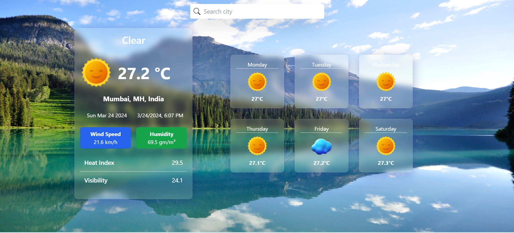

# Weather Application

Introducing our Weather Application, a robust tool designed to deliver precise weather forecasts for your location and any city around the globe. Our primary objective is to empower users with comprehensive weather data, enabling them to strategically plan their day-to-day activities.

Many individuals encounter obstacles in completing their tasks due to unforeseen weather conditions. Our application bridges this gap by offering detailed forecasts for the upcoming six days. By providing users with this valuable insight, they can proactively organize their schedules, taking into consideration the expected weather conditions and optimizing their plans for maximum efficiency and comfort.

## Features

- Our Weather application boasts a user-friendly interface that is not only visually appealing but also easy to navigate, ensuring a seamless user experience.
- Users can conveniently access a six-day forecast, facilitating informed decision-making for their daily activities. This comprehensive forecast empowers individuals to plan ahead, considering upcoming weather conditions for optimal scheduling.
- Gain insight into the current weather conditions with detailed data including humidity levels, visibility range, wind speed, and heat index. This comprehensive overview allows users to prepare adequately for the day ahead, whether indoors or outdoors.
- Explore weather forecasts for any city worldwide with our extensive search functionality. Whether you're planning a trip or simply curious about the weather in another location, our application provides instant access to accurate weather data for cities across the globe.
- Leveraging existing APIs, our application seamlessly retrieves up-to-date weather information for specific cities. This ensures the reliability and accuracy of the data presented to users, enhancing their trust in the application's capabilities.

## Technologies / Tools used for building this app includes

# Demo :movie_camera:

 View live preview [here]().

## Contact
If you have any suggestions on what to improve in <em>Weather Application </em> and would like to share them, feel free to drop mail to implement your own ideas 

Chintan Marvaniya - chintanmarvaniya985@example.com

Project Link: [https://github.com/chintanmarvaniya1/weather-app](https://github.com/chintanmarvaniya1/weather-app)
